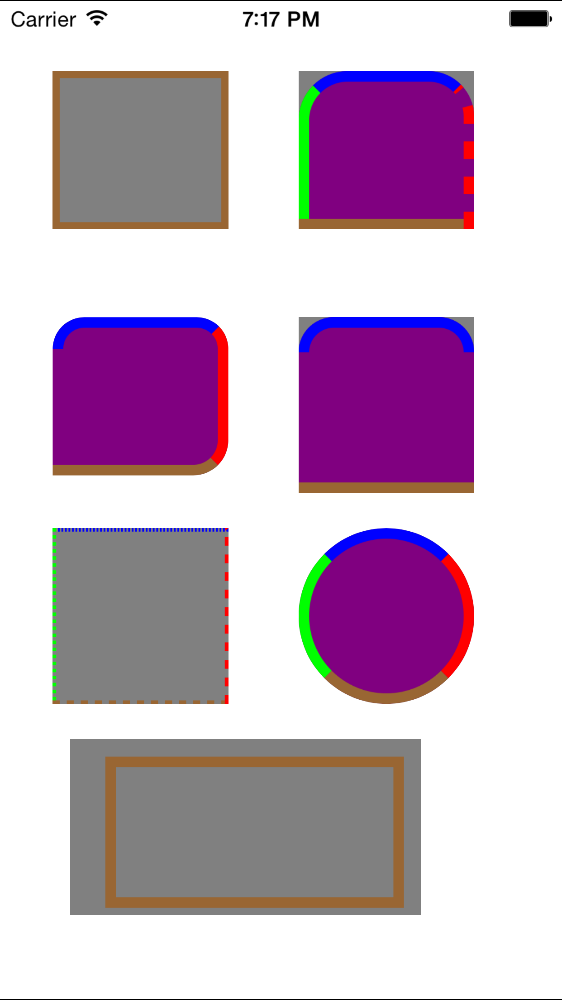

YRBorderView
============
支持Cocoapods安装

	   pod 'YRBorderView', '~> 1.0.0'

一个可以添加各种边线效果的View  

* 支持四条边不同弧度
* 支持四条边粗细不同
* 支持虚线类型
* 支持裁剪掉边界外面部分
* 支持设置控件内边距调整绘制线条位置

功能上算是比较全面了。

具体可看下面的效果图。

文字介绍 : [http://yueruo.github.io/iOS-YRBorderView.html](http://yueruo.github.io/iOS-YRBorderView.html)

